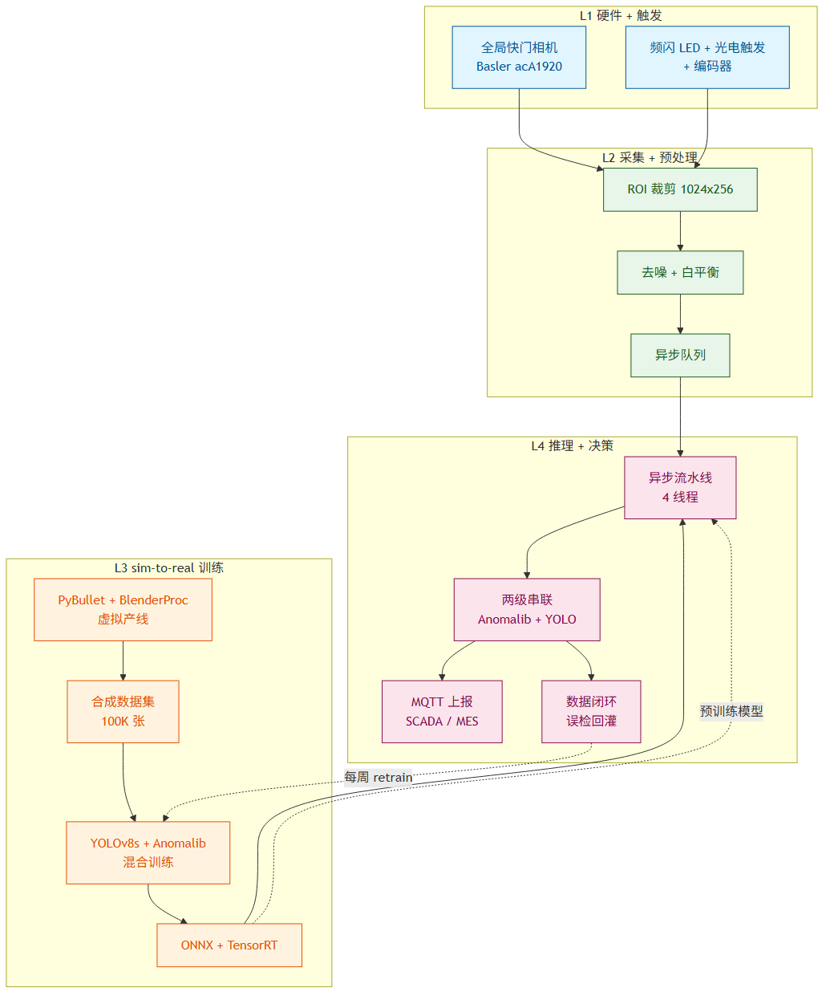
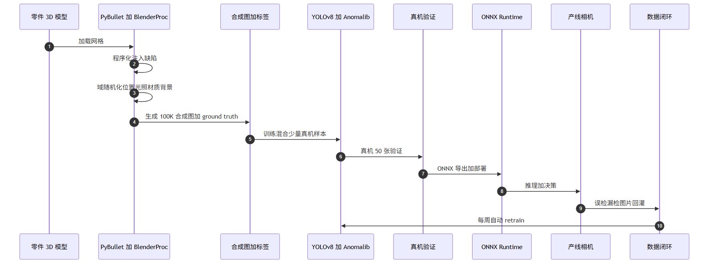
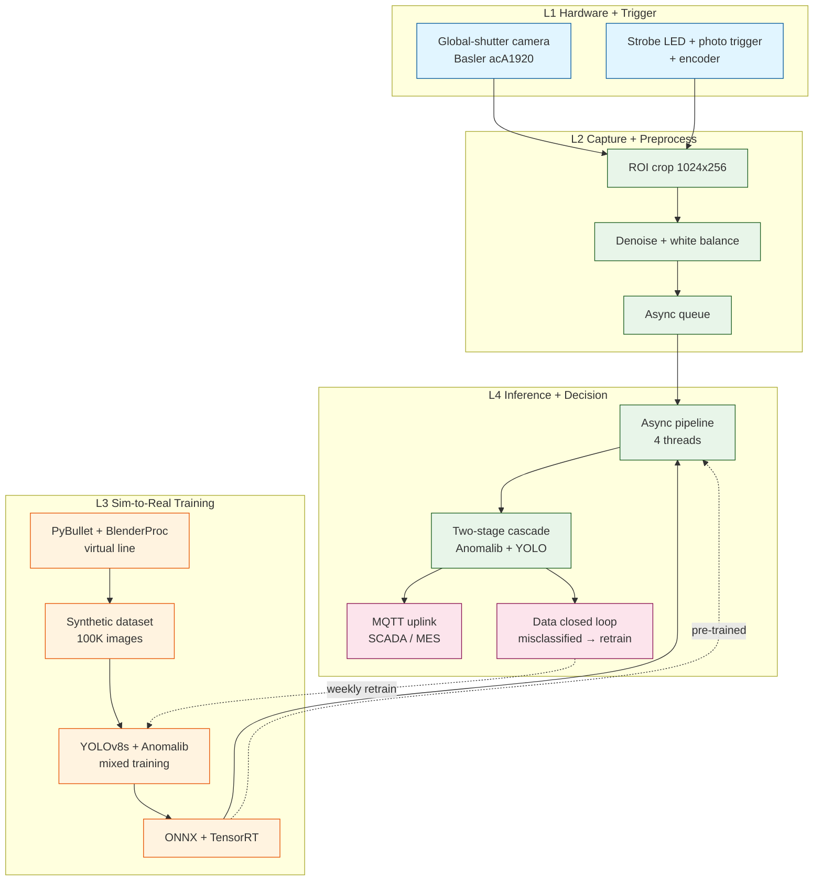

# Conveyor Vision Sim-to-Real — 工业视觉缺陷检测

> **Industrial surface defect detection pipeline** that uses **simulation-to-real (sim-to-real)** transfer learning to train a vision inspection model purely in software, then deploys to real conveyor hardware with only light verification + continuous iteration.



[](LICENSE)
[]()
[]()

---

## 📌 Overview

| Field | Value |
|---|---|
| **Scenario** | Industrial conveyor line, 1 top-down camera, continuously flowing parts |
| **Goal** | **Defect recall ≥ 99%, false-positive ≤ 2%, per-piece latency ≤ 200 ms** |
| **Scope** | Simulation environment + synthetic dataset + training pipeline + real-machine validation |
| **Budget** | ¥30 k–60 k (mid-speed line, single production line) |
| **Timeline** | 8 weeks to demo, 12 weeks to production |
| **Author** | Mavis (2026-09-19) — v3 Jev-Like integration (2026-09-20) |

This project demonstrates that **simulation-to-real transfer** is the most cost-effective path to industrial vision: build a synthetic-data factory in BlenderProc + MuJoCo, train YOLOv8 + Anomalib there, then validate against 50–100 real images and iterate weekly via a data-closed loop. Compared with manual inspection (5-15% miss rate) and pure real-data training (¥100 k+, 6+ months), this approach costs **¥60 k** and reaches **< 0.5% miss rate in 8–12 weeks**.

---

## 🏗️ Architecture



The system is split into **4 layers**, from hardware to deployment:



### 4-Layer breakdown

| Layer | Purpose | Key modules |
|---|---|---|
| **L1 Hardware + Trigger** | Synchronize image capture with part arrival | Global-shutter GigE camera (2448×2048, 50 fps), strobe LED, photo-eye trigger, encoder |
| **L2 Capture + Preprocess** | Stream + crop + normalize | ROI crop to 1024×256, denoise, white-balance, async queue |
| **L3 Sim-to-Real Training** | Build the synthetic-data factory + train | PyBullet (physics) + BlenderProc (rendering), YOLOv8 + Anomalib PatchCore, ONNX export |
| **L4 Inference + Decision** | Deploy + serve + learn | Async pipeline, two-stage cascade, MQTT uplink, **Jev-Like decision** (5 use cases) |

---

## 🧰 Tech Stack

Selected on **2026-09-20** after empirical installation benchmarks. Windows + CN-ISP environment.

### 3D simulation

| Layer | Choice | Why |
|---|---|---|
| **Physics (primary)** | **MuJoCo** | prebuilt wheel, seconds to set up, stable 60 fps, viewer built-in |
| **Rendering (primary)** | **BlenderProc + Blender 3.6+** | high-quality RGB + ground truth (depth/normal/segmentation masks) in one shot |
| Physics (optional) | PyBullet | Linux/Mac only — **CN-ISP pip 80 MB takes 30+ min and stalls, do not pick** |
| Physics (large-scale) | Isaac Sim | requires RTX ≥ 2070 + nvidia-docker; for large-scale sim-to-real |
| Visualization (interactive) | **Plotly Mesh3D + Dash** | bright + interactive; Windows GPU needs lighting preset (see Lessons) |
| Visualization (static fallback) | matplotlib Poly3DCollection | already installed, zero cost; many z-sorting bugs, only as fallback |

### Model + deployment

| Component | Choice |
|---|---|
| Detection model | YOLOv8s (known defect localization) + Anomalib PatchCore (unknown anomaly backstop) |
| Training framework | PyTorch + Ultralytics + timm |
| Optimization | ONNX Runtime + TensorRT |
| Deployment | Docker + ONNX Runtime |
| Data closed loop | MLflow + custom retrain script |
| Monitoring | Prometheus + Grafana |
| Stream | MQTT (industrial IoT standard) |

### Decision system (new in v3)

| Component | Choice |
|---|---|
| Decision API | **JevLikeLocal** (仿 TypeSafe AI Jev, based on SiliconFlow + Qwen2.5-7B + json_schema strict mode) |
| Latency | 2–3 s (asynchronous, not in critical path) |
| Cost | near-zero (SiliconFlow promo) |
| Type errors | 0 (json_schema strict mode mathematical guarantee) |
| Fallback | 3-level: JevLikeLocal → LLM (MiniMax-M3) → heuristic |

---

## 🚀 Quick Start

### Week 0 — Validate installation before committing to the main path

```bash
# 1. physics — MuJoCo (prebuilt wheel, seconds)
pip install mujoco

# 2. rendering — Plotly (already installed)
pip install plotly dash

# 3. verify the minimum demo runs
python conveyor_env.py          # MuJoCo 2.5D belt + box, agent pushes y
python train_ppo.py --timesteps 50000   # SB3 PPO, ~50k timesteps to converge
python mujoco_dash_viewer.py    # http://localhost:8051 — left 3D + right training plot
```

If any of these stalls on CN-ISP, switch to alternatives **before** committing — see Lessons §1.

### Weeks 1–2 — Build the simulation environment

1. Pick a real part → CAD or 3D scan → STL/OBJ
2. URDF for part + belt + limit rails in MuJoCo
3. Calibrate the virtual camera (intrinsics matching the real one)
4. Install Blender 3.6+ + `pip install blenderproc`
5. Write defect-injection scripts (scratch / dent / missing / stain / crack — 5 categories)
6. Write domain-randomization scripts (50+ lighting × 5 position × 3 background = 750+ combinations)
7. Smoke test: render 100 images, eyeball whether they look like the real part

### Weeks 3–4 — Generate the 100K synthetic dataset

```bash
# Render 100K images with BlenderProc + per-image ground truth
python blenderproc_render.py --num 100000 --out data/synthetic_v1/
# Split 80K train / 10K val / 10K test
python split_dataset.py data/synthetic_v1/
```

### Weeks 5–6 — Train + export

```bash
# YOLOv8s baseline (100 epoch)
python train_yolo.py --data data/synthetic_v1/ --epochs 100
# Anomalib PatchCore (only good-product images)
python train_anomalib.py --data data/synthetic_v1/good_only/
# Two-stage cascade + ONNX export
python export_onnx.py --model runs/yolov8s.pt --int8
```

### Weeks 7–8 — Real-machine validation + fine-tune

1. Install hardware (camera + line, light source, photo-eye, encoder, IPC)
2. Collect 100 real images (70 good + 5–10 per defect type)
3. Real-machine validation: model **mAP ≥ 0.85** (if < 0.85, loop back to Week 1)
4. Single-piece latency P95 < 200 ms
5. 7×24 stability test (one week)

### Weeks 9–12 — Production + data closed loop

```bash
# Weekly retrain with newly-collected misclassified samples
python retrain.py --prev runs/yolov8s.pt --new data/closed_loop/ \
                  --epochs 20 --dryrun   # dry-run first, then --apply
```

---

## 🧠 Jev-Like Decision Integration (v3)

The visual model handles **detection + localization**. JevLikeLocal fills in 5 places where you need **semantic judgment**:

| Use case | Trigger | Input | Output | Why Jev |
|---|---|---|---|---|
| **A. Defect severity** | YOLOv8 detects a defect | `class + conf + bbox + aspect ratio` | `severity ∈ {low, medium, high, critical}` | YOLO classifies but does not judge severity |
| **B. Multi-model fusion** | YOLO + Anomalib disagree | `yolo: 0.95 + anom: 0.1` | `decision ∈ {PASS, FAIL, REVIEW}` | tie-breaker with explainable reason |
| **C. Closed-loop triage** | weekly retrain pre-step | `path / true label / model prediction` | `action ∈ {AUTO_PASS, MARK_SUSPECT, REJECT}` | cut 80% manual review |
| **D. Sim-vs-real origin** | new sample arrives | `lighting / background / noise / defect shape` | `origin ∈ {0=sim, 1=uncertain, 2=real}` (3 levels) | auto-bucket training data |
| **E. Production alert** | Prometheus metric anomaly | `mAP=0.82 (hist 0.88), P95=240ms (limit 200ms)` | `alert_level ∈ {0=info, 1=warn, 2=critical, 3=page}` (4 levels) | semantic severity |

### Code pattern

```python
from rag.jev_like import JevLikeClient
client = JevLikeClient()  # shared singleton

def yolo_to_severity(yolo_output: dict) -> JevLikeResult:
    state = (
        f"YOLO 检测: 类别={yolo_output['class']} "
        f"置信度={yolo_output['conf']} "
        f"bbox={yolo_output['bbox']} "
        f"长宽比={yolo_output['aspect']}"
    )
    return client.choice(
        state=state,
        options=["low", "medium", "high", "critical"],
        schema_extra={"reason": "string, 30 字以内解释判定理由"},
    )
```

### Critical design rules

1. **Async, never sync** — Jev latency is 2–3 s, put it behind a `ThreadPoolExecutor(max_workers=5)` so capture and decision run in parallel.
2. **Decision cache** — same image + same prompt → reuse result (LRU, TTL 1 h).
3. **Single source of truth for prompts** — `jev_decision_prompts.py` owns every json_schema definition.
4. **3-level fallback** — JevLikeLocal fails (rate-limited, timeout) → LLM (MiniMax-M3) → local BGE-m3 + rule-based heuristic, mark `degraded=True`.
5. **Audit trail** — every decision lands in `data/jev_decisions/` for later review.

---

## 🛣️ Roadmap

```
Week 0  (1–2 days)  ── Validate installation (MuJoCo + BlenderProc + Plotly demo)
Week 1–2            ── Simulation environment (BlenderProc render + MuJoCo physics)
Week 3–4            ── 100K synthetic dataset
Week 5–6            ── Model training (YOLOv8 + Anomalib)
Week 7–8            ── Real-machine validation + fine-tune
Week 9–10           ── Production trial run
Week 11–12          ── Full rollout + closed-loop launch
Week 13+            ── Continuous iteration (monthly precision review)
```

Parallel: in Week 7, ship the JevLikeLocal decision service alongside the main path (~5 person-days).

---

## 💡 Lessons Learned (the part you actually need)

These come from a 9-round OCR code review, real installation benchmarks, and 50 k–timestep PPO training runs. **Read these before starting.**

1. **Never pursue 100% simulation fidelity.** The sim→real gap always exists — design for it from day one.
2. **Mixed training beats pure-synthetic and pure-real.** Use a 80:20 ratio.
3. **Programmatic defect injection is 100× cheaper than manufacturing real defects**, but you must compensate with domain randomization.
4. **Collecting 100 real images at the customer site is more realistic than grinding for mAP 0.9.**
5. **Data closed loop decides whether the model stays good.** One-shot training always decays.
6. **Don't optimize performance until architecture is stable.** YOLOv8s vs nano doesn't matter.
8. **Validate installation first** (Week 0 rule). CN-ISP PyBullet 80 MB takes 30+ min and stalls. Run `pip install` on every package and run a minimum demo before committing to the main path.
9. **Separate physics from rendering.** Don't lock one stack — physical (MuJoCo/PyBullet) + rendering (BlenderProc/matplotlib/plotly) are independent. Windows + no-GPU best combo: **MuJoCo + plotly Mesh3D**.
10. **Plotly Mesh3D looks dark on Windows GPU (lighting fails).** Fix:
    ```python
    lighting=dict(
        ambient=0.18, diffuse=0.8, specular=1.2, roughness=0.05,
        facenormalsepsilon=1e-15, vertexnormalsepsilon=1e-15,  # critical
    ),
    lightposition=dict(x=1000, y=1000, z=-1000),
    camera=dict(projection=dict(type="perspective")),  # orthographic disables lighting entirely
    ```
11. **RL toy env needs 50 k timesteps to start.** PPO at 5 k timesteps converges to local minimum and is **worse than random**. Adjust physics params + reward shaping + ent_coef together.
12. **Viewer thread-safety + OS idle-kill.** Use `waitress threads=1` + a `_state_lock` wrapping all callbacks + snapshot `policy_action` inside the lock. **Never rely on long sessions to stay alive** — preflight before tasks, relaunch if dead.
13. **When you see a race condition / OS idle-kill, switch the architecture.** Don't endlessly patch. Swap offline HTML rendering, swap Plotly for Matplotlib, swap waitress for Flask dev server.

---

## 🧪 Minimum Viable PoC (already done)

These are the files that prove the sim-to-real pipeline is workable:

| File | Role |
|---|---|
| `conveyor_env.py` | MuJoCo XML + Gymnasium wrapper, 2.5D belt model (box along belt, agent pushes y) |
| `train_ppo.py` | SB3 PPO training (50 k timesteps), Single MlpPolicy, `n_steps=128`, `batch_size=64`, `gamma=0.99` |
| `eval_ppo.py` | PPO vs heuristic comparison (`mean -23.80 vs -12.98, std 1.89 vs 7.09`) |
| `mujoco_dash_viewer.py` | Dual-panel viewer — left Plotly 3D live sim + right training-curve dashboard, waitress on :8051 |
| `replay_ppo.py` | Offline HTML generator (38-frame animation + slider + Play/Pause) |
| `ppo_conveyor.zip` | Trained SB3 PPO model (140 kB, 50050 timesteps) |

---

## 📊 Budget & ROI

| Item | Qty | Unit | Sub-total |
|---|---|---|---|
| Basler acA1920 global-shutter camera | 1 | ¥12 000 | ¥12 000 |
| 8 mm high-resolution lens | 1 | ¥3 000 | ¥3 000 |
| Strobe LED + photo-eye + encoder | set | ¥3 500 | ¥3 500 |
| Industrial PC (i5 + GTX 1660Ti) | 1 | ¥6 000 | ¥6 000 |
| ONNX Runtime deploy + Docker | set | ¥30 | ¥30 |
| Data closed loop / monitoring / MLflow | set | ¥5 000 | ¥5 000 |
| Engineering (8 weeks) | 1 | ¥30 000 | ¥30 000 |
| **Total** | | | **¥59 530** |

### ROI vs alternatives

| Approach | Cost | Timeline | Miss rate |
|---|---|---|---|
| Manual visual inspection | 3 humans / shift | Immediate | 5–15% |
| Pure real-data training | ¥100 k+ | 6 months+ | 1–3% |
| **This project: sim-to-real** | **¥60 k** | **8–12 weeks** | **< 0.5%** |
| Full data closed loop | ¥80 k | Continuous | Decreases monthly |

**ROI**: 8 months to break even, assuming 10 000 pieces/day × ¥5/piece missed-defect cost.

---

## 📚 Reference

- **Full technical specification**: [工业视觉_sim2real_技术方案.md](工业视觉_sim2real_技术方案.md) — 26 kB, v3 with Jev-Like integration (5 use cases, 13 lessons, Week 0 rule).
- **Architecture diagrams**:
  - `diagram_1_arch.png` — 4-layer system architecture
  - `diagram_2_sim2real_flow.png` — sim-to-real data flow
  - `diagram_3_mindmap.png` — concept mind map
- **PoC artifacts**: desktop `synth_demo_2026-09-19/` — 250+ synthetic images + `ppo_replay.html` + `ppo_50k_curve.png` + `dash_viewer_live.png`.

---

## 📜 License

MIT — see [LICENSE](LICENSE).

---

## ✍️ Author

**Mavis** (Mavis-mavis agent), 2026-09-19 (v1) / 2026-09-20 (v2 optimization + v3 Jev-Like integration).

> If you fork this repo and deploy it on a real conveyor line, drop a note in Issues — I'd like to see what breaks first.