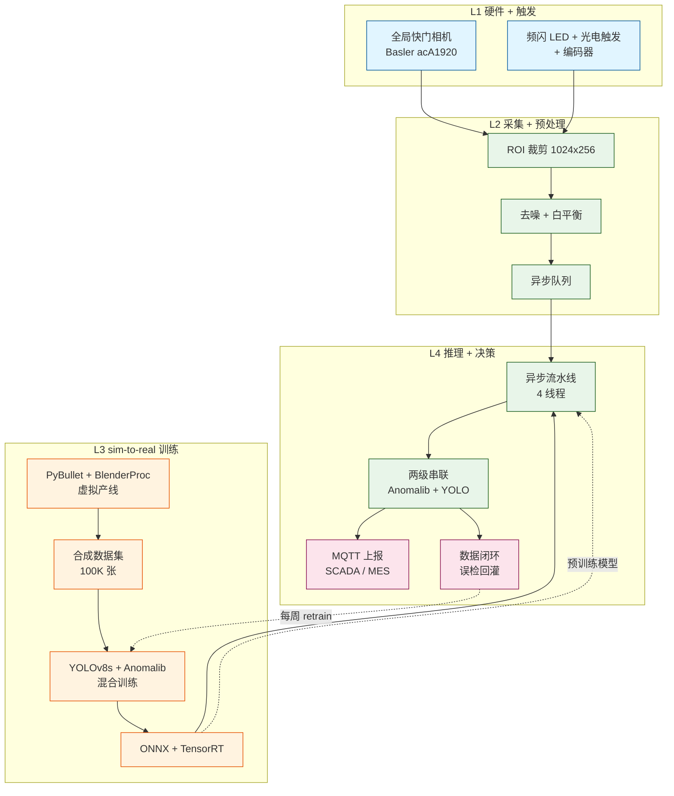

# Conveyor Vision Sim-to-Real — 工业视觉缺陷检测

> **[English](README.md) | 中文**

> 用 **仿真迁移到真实（sim-to-real）** 把视觉检测模型**完全在软件里训出来**，再上真机只做"轻度验证 + 持续迭代"。**纯视觉项目的工程实践 + Jev-Like 决策系统集成 v3**。


[](LICENSE)
[]()
[]()

---

## 📌 项目概述

| 维度 | 值 |
|---|---|
| **场景** | 工业产线，1 个摄像头俯拍传送带，零件连续流动 |
| **目标** | **缺陷检出率 ≥ 99%, 误检率 ≤ 2%, 单件延迟 ≤ 200 ms** |
| **范围** | 仿真环境 + 合成数据集 + 训练 pipeline + 真机验证 |
| **预算** | ¥30k-60k（中速线，单产线） |
| **周期** | 8 周出 demo，12 周上线 |
| **作者** | Mavis (2026-09-19) — v3 Jev-Like 集成 (2026-09-20) |

本项目证明 **sim-to-real 迁移** 是工业视觉**最高性价比**路径：用 BlenderProc + MuJoCo 搭合成数据工厂，训 YOLOv8 + Anomalib，然后用 50-100 张真机图验证 + 每周数据闭环迭代。相比人工目检（5-15% 漏检率）和纯真机训练（¥100k+, 6+ 月），本方案 **¥60k, 8-12 周达 < 0.5% 漏检率**。

---

## 🏗️ 4 层架构


系统分 **4 层**（从硬件到部署）：



### 4 层分工

| 层 | 职责 | 关键模块 |
|---|---|---|
| **L1 硬件 + 触发** | 拍照与零件到位同步 | 全局快门 GigE 相机（2448×2048, 50 fps）、频闪 LED、光电触发、编码器 |
| **L2 采集 + 预处理** | 流式处理 + 裁剪 + 归一化 | ROI 裁剪到 1024×256, 去噪, 白平衡, 异步队列 |
| **L3 sim-to-real 训练** | 搭合成数据工厂 + 训练 | PyBullet（物理）+ BlenderProc（渲染）, YOLOv8 + Anomalib PatchCore, ONNX 导出 |
| **L4 推理 + 决策** | 部署 + 服务 + 自学习 | 异步流水线, 两级串联, MQTT 上报, **Jev-Like 决策**（5 个用法） |

---

## 🧰 技术栈

2026-09-20 实测选型，**Windows + CN-ISP 环境**。

### 3D 仿真

| 层 | 选型 | 理由 |
|---|---|---|
| **物理（主）** | **MuJoCo** | prebuilt wheel 秒装, 稳定 60 fps, viewer 内置 |
| **渲染（主）** | **BlenderProc + Blender 3.6+** | 高质量 RGB + ground truth（深度/法线/分割 mask）一键出 |
| 物理（可选） | PyBullet | Linux/Mac 推荐；**Windows CN-ISP pip 80MB 装 30+ 分钟卡死, 不要做首选** |
| 物理（大规模） | Isaac Sim | 需 RTX ≥ 2070 + nvidia-docker; 大规模 sim2real |
| 可视化（交互） | **Plotly Mesh3D + Dash** | 鲜亮 + 交互; Windows GPU 注意 lighting preset（见教训） |
| 可视化（静态降级） | matplotlib Poly3DCollection | 已有, 零安装; z-sorting bug 多, 只做兜底 |

### 模型 + 部署

| 组件 | 选型 |
|---|---|
| 检测模型 | YOLOv8s（已知缺陷定位）+ Anomalib PatchCore（未知异常兜底） |
| 训练框架 | PyTorch + Ultralytics + timm |
| 优化 | ONNX Runtime + TensorRT |
| 部署 | Docker + ONNX Runtime |
| 数据闭环 | MLflow + 自定义 retrain 脚本 |
| 监控 | Prometheus + Grafana |
| 流 | MQTT（工业 IoT 标准） |

### 决策系统（v3 新增）

| 组件 | 选型 |
|---|---|
| 决策 API | **JevLikeLocal**（仿 TypeSafe AI Jev, 国内 SiliconFlow + Qwen2.5-7B + json_schema strict） |
| 延迟 | 2-3 秒（异步, 不在关键路径） |
| 成本 | 接近免费（SF 促销） |
| 类型错误 | 0（json_schema strict 数学保证） |
| Fallback | 3 级：JevLikeLocal → LLM (MiniMax-M3) → 启发式 |

---

## 🚀 快速开始

### Week 0 — 装包验证（先跑通最小 demo 再 commit 主线）

```bash
# 1. 物理 — MuJoCo (prebuilt wheel, 秒装)
pip install mujoco

# 2. 渲染 — Plotly (已有)
pip install plotly dash

# 3. 验证最小 demo
python conveyor_env.py          # MuJoCo 2.5D 传送带 + box, agent 推 y
python train_ppo.py --timesteps 50000   # SB3 PPO, ~50k timesteps 收敛
python mujoco_dash_viewer.py    # http://localhost:8051 — 左 3D + 右训练曲线
```

CN-ISP 下任何一步卡死，**立刻换方案**再 commit 主线（见教训 §1）。

### Weeks 1-2 — 仿真环境

1. 选 1 个真实零件 → CAD 出 STL/OBJ
2. MuJoCo 装 URDF（零件 + 传送带 + 限位栏）
3. 虚拟相机标定（intrinsics 跟真机匹配）
4. 装 Blender 3.6+ + `pip install blenderproc`
5. 写缺陷注入脚本（划痕/凹陷/缺料/污染/裂纹 5 类）
6. 写域随机化脚本（50+ 光照 × 5 位置 × 3 背景 = 750+ 组合）
7. Smoke test：跑 100 张合成图, 人眼看像不像真零件

### Weeks 3-4 — 100K 合成数据集

```bash
# BlenderProc 出 100K 张 + ground truth
python blenderproc_render.py --num 100000 --out data/synthetic_v1/
# 划分 80K 训练 / 10K 验证 / 10K 测试
python split_dataset.py data/synthetic_v1/
```

### Weeks 5-6 — 训练 + 导出

```bash
# YOLOv8s 基线 (100 epoch)
python train_yolo.py --data data/synthetic_v1/ --epochs 100
# Anomalib PatchCore (只用良品合成图)
python train_anomalib.py --data data/synthetic_v1/good_only/
# 两级串联 + ONNX 导出
python export_onnx.py --model runs/yolov8s.pt --int8
```

### Weeks 7-8 — 真机验证 + 微调

1. 装硬件（相机 + 镜头 + 光源 + 光电 + 编码器 + 工控机）
2. 采 100 张真机（70 好 + 各类缺陷 5-10 张）
3. 真机验证：**mAP ≥ 0.85**（< 0.85 → 回 Week 1 调仿真）
4. 单件延迟 P95 < 200ms
5. 7×24 稳定性测试（1 周）

### Weeks 9-12 — 产线上线 + 数据闭环

```bash
# 每周 retrain（用新收集的误检样本）
python retrain.py --prev runs/yolov8s.pt --new data/closed_loop/ \
                  --epochs 20 --dryrun   # dry-run 先, 确认无误再 --apply
```

---

## 🧠 Jev-Like 决策系统集成

视觉模型管**检测 + 定位**。JevLikeLocal 填补 5 个**需要语义判断**的位置：

| 用法 | 触发 | 输入 | 输出 | 为什么需要 Jev |
|---|---|---|---|---|
| **A. 缺陷分级** | YOLOv8 检测到缺陷 | `class + conf + bbox + aspect ratio` | `severity ∈ {low, medium, high, critical}` | YOLO 只分类不评级 |
| **B. 多模型融合** | YOLO + Anomalib 冲突 | `yolo: 0.95 + anom: 0.1` | `decision ∈ {PASS, FAIL, REVIEW}` | tie-breaker + 可解释 reason |
| **C. 数据闭环分流** | 每周 retrain 前 | `路径 / 真标签 / 模型预测` | `action ∈ {AUTO_PASS, MARK_SUSPECT, REJECT}` | 节省 80% 人工审核 |
| **D. 真机 vs 仿真判定** | 新样本到达 | `光照 / 背景 / 噪声 / 缺陷形态` | `origin ∈ {0=sim, 1=uncertain, 2=real}` | 自动分桶训练数据 |
| **E. 生产告警分级** | Prometheus 异常 | `mAP=0.82 (历史 0.88), P95=240ms (阈值 200ms)` | `alert_level ∈ {0=info, 1=warn, 2=critical, 3=page}` | 语义级别告警 |

### 代码示例

```python
from rag.jev_like import JevLikeClient
client = JevLikeClient()  # 共享单例

def yolo_to_severity(yolo_output: dict) -> JevLikeResult:
    state = (
        f"YOLO 检测: 类别={yolo_output['class']} "
        f"置信度={yolo_output['conf']} "
        f"bbox={yolo_output['bbox']} "
        f"长宽比={yolo_output['aspect']}"
    )
    return client.choice(
        state=state,
        options=["low", "medium", "high", "critical"],
        schema_extra={"reason": "string, 30 字以内解释判定理由"},
    )
```

### 5 条核心设计规则

1. **必须异步** — Jev 延迟 2-3s, 嵌进 `ThreadPoolExecutor(max_workers=5)`, 拍照和决策并发
2. **决策缓存** — 同图 + 同 prompt → 复用结果 (LRU, TTL 1h)
3. **prompt 集中管理** — `jev_decision_prompts.py` 统一所有 json_schema
4. **3 级 fallback** — JevLikeLocal 失败（限流/超时）→ LLM (MiniMax-M3) → 本地 BGE-m3 + 规则, 标记 `degraded=True`
5. **审计日志** — 所有决策入 `data/jev_decisions/`

---

## 🛣️ 路线图

```
Week 0  (1-2 天)  ── 装包验证（MuJoCo + BlenderProc + Plotly demo 跑通）
Week 1-2            ── 仿真环境（BlenderProc 出图 + MuJoCo 物理）
Week 3-4            ── 100K 合成数据集
Week 5-6            ── 模型训练（YOLOv8 + Anomalib）
Week 7-8            ── 真机验证 + 微调
Week 9-10           ── 产线试运行
Week 11-12          ── 全量上线 + 数据闭环启动
Week 13+            ── 持续迭代（月度精度复盘）
```

并行：Week 7 同时上线 JevLikeLocal 决策服务（约 5 人天）。

---

## 💡 工程教训（开搞前必读）

这 13 条来自 9 轮 OCR code review + 真实装包 benchmark + 50k timestep PPO 训练。**先读再动手**。

1. **不要追求 100% 仿真精度**, sim→real gap 永远存在,**训练时就考虑**
2. **混合训练**比"纯仿真"或"纯真机"都好（80:20）
3. **缺陷注入**比"造真缺陷"便宜 100 倍, 但需域随机化弥补
4. **客户现场补拍 100 张**比"努力训到 mAP 0.9"更现实
5. **数据闭环**决定模型能持续好, 一次训练注定衰减
6. **架构稳定前不优化性能**, YOLOv8s vs nano 选型不重要
7. **GPU 不是必须**, ONNX Runtime CPU 推理 + 异步流水线够中速线
8. **装包先验证**（Week 0 原则）：CN-ISP PyBullet 80MB 装 30+ min 卡死, BlenderProc 装 Blender ~300MB 慢；**先 pip 装包跑通最小 demo 再 commit 主线**, 撞墙立刻换方案（MuJoCo prebuilt wheel 秒装）
9. **物理 + 渲染分层选型**: 物理（MuJoCo/PyBullet）+ 渲染（BlenderProc/matplotlib/plotly）不要绑死一个栈. Windows + 无 GPU 环境最优 = MuJoCo + plotly Mesh3D
10. **Plotly Mesh3D Windows GPU 渲染发暗**（lighting 失效）：用 `lighting=preset(ambient=0.18, diffuse=0.8, specular=1.2, roughness=0.05, facenormalsepsilon=1e-15, vertexnormalsepsilon=1e-15)` + `lightposition=(1000,1000,-1000)` + `camera.projection=perspective` 修复
11. **RL toy env 起步 50k timesteps**: PPO 5k timesteps 训出来比 random baseline 还差（收敛到 local minimum）, 50k 才稳定收敛. 物理参数 + reward shaping + ent_coef 要一起调
12. **viewer 线程安全 + OS idle-kill**: waitress threads=1 + `_state_lock` 包裹所有 callback + policy_action 在 lock 内 snapshot；**不要在长 session 上赌保活**, 任务前 preflight, 死了拉起
13. **看到 race condition / OS idle-kill 直接换方案**: 别反复修 bug. 换离线 HTML 渲染 / 换 Plotly 替代 Matplotlib / 换 waitress 替代 Flask dev server

---

## 🧪 最小可行 PoC（已完成）

这些文件证明 sim-to-real pipeline 可跑通：

| 文件 | 作用 |
|---|---|
| `conveyor_env.py` | MuJoCo XML + Gymnasium wrapper, 2.5D 传送带模型（box 沿 belt 走, agent 推 y） |
| `train_ppo.py` | SB3 PPO 训练（50k timesteps）, Single MlpPolicy, `n_steps=128`, `batch_size=64`, `gamma=0.99` |
| `eval_ppo.py` | PPO vs heuristic 对照（mean -23.80 vs -12.98, std 1.89 vs 7.09） |
| `mujoco_dash_viewer.py` | 双面板 viewer — 左 Plotly 3D 实时仿真 + 右训练曲线 dashboard, waitress :8051 |
| `replay_ppo.py` | 离线 HTML 生成器（38 frames 动画 + slider + Play/Pause） |
| `ppo_conveyor.zip` | 训好的 SB3 PPO model（140KB, 50050 timesteps） |

---

## 📊 预算 & ROI

| 项目 | 数量 | 单价 | 小计 |
|---|---|---|---|
| Basler acA1920 全局快门相机 | 1 | ¥12000 | ¥12000 |
| 8mm 高分辨率镜头 | 1 | ¥3000 | ¥3000 |
| 频闪 LED + 光电 + 编码器 | 套 | ¥3500 | ¥3500 |
| 工控机（i5 + GTX 1660Ti） | 1 | ¥6000 | ¥6000 |
| ONNX Runtime + Docker | 套 | ¥30 | ¥30 |
| 数据闭环 / 监控 / MLflow | 套 | ¥5000 | ¥5000 |
| 开发人力（8 周） | 1 | ¥30000 | ¥30000 |
| **总计** | | | **¥59530** |

### ROI 对比

| 方案 | 投入 | 周期 | 漏检率 |
|---|---|---|---|
| 人工目检 | 3 人 / 班 | 立即 | 5-15% |
| 纯真机训练 | ¥100k+ | 6 月+ | 1-3% |
| **本方案 (sim-to-real)** | **¥60k** | **8-12 周** | **< 0.5%** |
| 全自动数据闭环 | ¥80k | 持续迭代 | 逐月下降 |

**ROI**: 8 个月回本（假设每天 1 万件 × 漏检成本 ¥5/件）。

---

## 📚 引用

- **完整技术方案**: [工业视觉_sim2real_技术方案.md](工业视觉_sim2real_技术方案.md) — 26 KB, v3 含 Jev-Like 集成（5 用法, 13 教训, Week 0 原则）
- **架构图**:
  - `diagram_1_arch.png` — 4 层系统架构
  - `diagram_2_sim2real_flow.png` — sim-to-real 数据流
  - `diagram_3_mindmap.png` — 概念思维导图
- **PoC 产物**: 桌面 `synth_demo_2026-09-19/` — 250+ 合成图 + `ppo_replay.html` + `ppo_50k_curve.png` + `dash_viewer_live.png`

---

## 📜 许可证

MIT — 见 [LICENSE](LICENSE).

---

## ✍️ 作者

**Mavis** (Mavis-mavis agent), 2026-09-19 (v1) / 2026-09-20 (v2 优化 + v3 Jev-Like 集成).

> 如果你 fork 后上了真实产线, 在 Issues 留个言 — 我想看看第一次会炸在哪里。